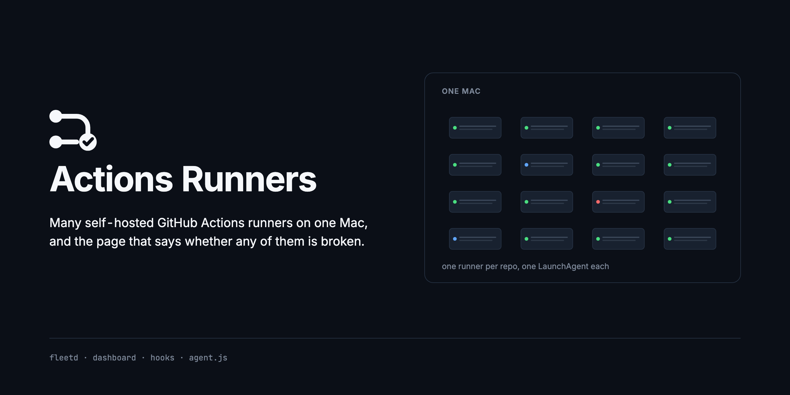
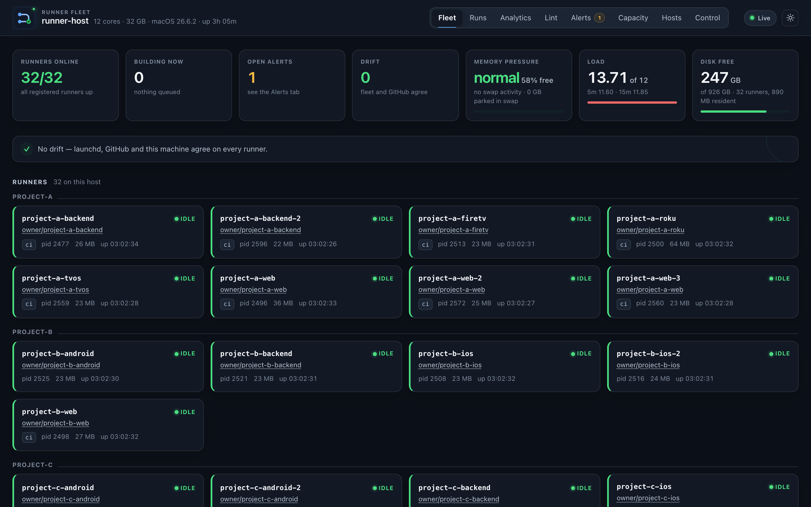
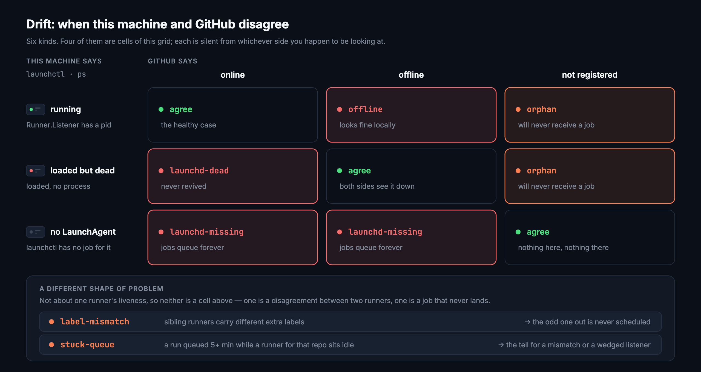
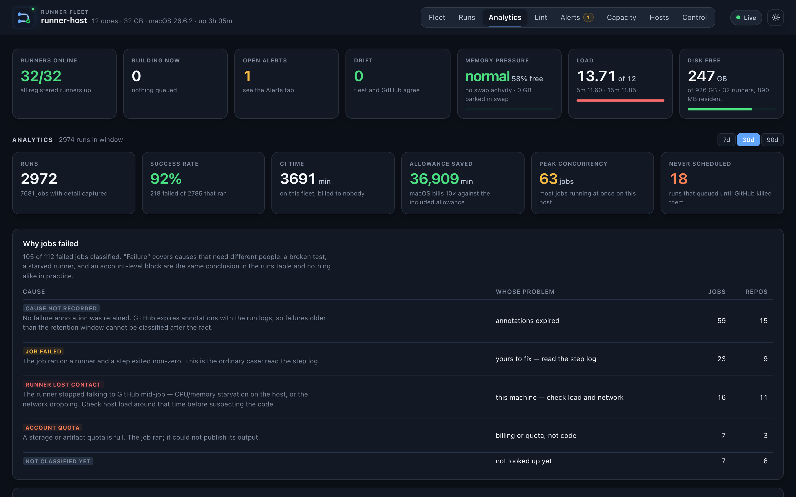

# Actions Runners

[](https://github.com/addisdev/actions-runners/actions/workflows/ci.yml)
[](https://addisdev.github.io/actions-runners/)
[](https://github.com/addisdev/actions-runners/releases)
[](LICENSE)



Register, supervise and observe a fleet of self-hosted GitHub Actions runners
on one Apple Silicon Mac — one runner per repo, each its own directory and its
own LaunchAgent. One Node daemon with no dependencies and no build step polls
GitHub and the machine, keeps everything it learns in SQLite forever, and
serves a single page.

The dashboard exists because GitHub has no cross-repo Actions view, and half of
the question — *is that runner even alive* — is not answerable from GitHub at
all.



> A live fleet, with repository and host names replaced. Green means launchd,
> GitHub and this machine agree.

> [!CAUTION]
> **Self-hosted runners on public repositories are a security risk.** Any
> fork's pull request can execute code on your Mac. This project is built for
> **private repos with trusted contributors**. Read the
> [security guide](docs/security-hardening.md) before you register anything.

## Fifteen seconds


> A real runner on a real fleet, killed and repaired while the daemon watched.
> Repository and host names replaced. The clock runs at 6.5x; nothing else does.

The service is killed, leaving the launchd job loaded with no process behind
it — the failure **no runner plist's `KeepAlive` will undo**, because none of
them sets it. Nothing external revives it and no job for that repo will ever
start again. The daemon notices on its own poll, opens `launchd-dead` in Drift
with the last exit code, and raises an alert; `health.sh --repair` restarts the
service, and the row closes once launchd and GitHub agree again.

None of it is staged. It is frames of the real dashboard against a real fleet,
which is why it is the one asset in `docs/img/` that cannot be produced from
fixtures — a fixture fleet can hold a dead runner, but it cannot die.
[`docs/brand.md`](docs/brand.md) records how it was made.

## Documentation

**[addisdev.github.io/actions-runners](https://addisdev.github.io/actions-runners/)**

| | |
|---|---|
| **[Get started](https://addisdev.github.io/actions-runners/getting-started/)** | A runner registered, the dashboard up, and a real workflow job running on your own Mac. |
| **[Concepts](https://addisdev.github.io/actions-runners/concepts/)** | What a runner is here, what launchd will not do for it, what drift means, and why a job is queued. |
| **[Design notes](https://addisdev.github.io/actions-runners/design/)** | Why it is shaped this way. Every argument is grounded in something that went wrong on a real fleet. |

## Five-minute quick start

```bash
git clone https://github.com/addisdev/actions-runners.git ~/actions-runners
cd ~/actions-runners
./preflight.sh                          # check this host
./register.sh owner/project-ios         # register first runner
cd dashboard && ./fleetctl.sh install   # start the dashboard
./fleetctl.sh token                     # save this token
# Open http://localhost:7878
```

Then point a workflow at it. `timeout-minutes` is not optional: GitHub's
six-hour default never applied to self-hosted runners, so a hung job holds its
runner until somebody notices.

```yaml
jobs:
  build:
    runs-on: [self-hosted, macos, arm64]
    timeout-minutes: 30
    steps:
      - uses: actions/checkout@v4
      - run: ./scripts/build.sh
```

Needs macOS 14+ on Apple Silicon, Homebrew at `/opt/homebrew`, the
[`gh` CLI](https://cli.github.com) authenticated, `python3`, and Node 22.5 or
newer for the dashboard. The full list is in
[Get started](docs/getting-started.md).

## How it fits together


One process does both jobs. The collector and the server share the snapshot in
memory, so the live view never polls, and there is one LaunchAgent to reason
about at 3 am instead of two. Everything runs under launchd — which is also how
it gets a GitHub token, because `gh` keeps that token in the login keychain and
only a launchd job can read it.

## What it watches



**Drift is the set of states where launchd and GitHub disagree about a runner**,
and each one is silent from whichever side you happen to be looking at. A
runner registered on GitHub with no LaunchAgent queues jobs forever. A listener
GitHub calls offline looks fine locally.

One rule exists because **no runner plist sets `KeepAlive`** — launchd loads the
service, starts it, and then does nothing further. A crashed runner is never
revived, and the only symptom is one repo's jobs queuing while every other repo
looks healthy.

The other question the fleet has to answer is why a job is sitting in a queue.
That used to be one check — *is a runner idle* — which separated the wrong pair,
because "every runner is busy" and "the host is saturated" both look like *no
runner is idle*, and only the first is fixed by adding a runner. It is now
[eight classified causes](https://addisdev.github.io/actions-runners/concepts/#why-a-job-is-queued),
each carrying the evidence it used, and exactly one of them offers to add a
runner.

## The numbers exclude what would make them wrong



Cancelled runs are out of every duration percentile, because a cancelled run's
duration measures how long until something killed it. Jobs that never reached a
runner are out of concurrency, because they present as day-long intervals
overlapping everything — 139 of them once reported a peak concurrency of 34 on
a host with 16 runners, a number that cannot happen.

`conclusion = 'failure'` is one value covering causes that need different people
to do different things. Measured over 30 days on this fleet, **58% of failed
jobs were not about the code at all** — they were the account's Actions spending
limit refusing to start the job, which blocks self-hosted jobs too, on runners
that were idle and healthy the whole time.

## Why self-host on Apple Silicon

GitHub-hosted macOS minutes bill at **10x** against the included allowance on
private repos. More critically, one iOS repo exhausting that allowance blocks
Actions **account-wide**, taking down the cheap Ubuntu jobs in unrelated repos
with it. A fleet on hardware you own removes that shared fate.

The cost you pay is owning the host's health. Idle listeners are nearly free at
about 7 MB each; two simultaneous Xcode builds are not. Sizing is per repo
rather than fleet-wide, because average concurrency across 27 runners was
**0.2** while **21% of 7,631 jobs still waited over a minute to start** — work
queueing while 26 runners sat idle, because a runner serves one job at a time
and each repo had exactly one.

If you want cloud autoscaling, use
[actions-runner-controller](https://github.com/actions/actions-runner-controller)
instead. This is one Mac, no Kubernetes, no cloud control plane.

## What is in here

| | What it is |
|---|---|
| **[`dashboard/`](dashboard)** | The daemon and the page. `fleetd.js`, the collector and server, SQLite, and a browser UI with no build step. Zero runtime dependencies, on purpose. |
| **Fleet scripts** | `preflight.sh`, `register.sh`, `status.sh`, `health.sh`, `runs.sh`, `cleanup.sh` at the top level; the rest in [`scripts/`](scripts). Every destructive one is dry-run by default. |
| **[`hooks/`](hooks)** | `job-started` and `job-completed`. The only mechanism that can hold a job already dispatched to a runner. |
| **[`examples/`](examples)** | Workflow files, `fleet.env` for three deployment shapes, and the LaunchAgent plists. |
| **[`docs/`](docs)** | The handbook, its figures, and the rig that renders them. |

Every script is documented with its flags and what it refuses to do in the
[scripts reference](docs/reference/scripts.md).

## Things learned the hard way

Each of these changed the design, and each is written up properly in the
[design notes](https://addisdev.github.io/actions-runners/design/).

- **Swap used on macOS is an accumulator, not a gauge.** The host tile once led
  with it and showed orange on a perfectly healthy machine: 4.3 GB of swap
  "used" while memory was 71% free, load was 1.0, and thirty seconds of
  sampling showed zero swapins. It now leads with the kernel's own memory
  pressure and the swap-in *rate*.
- **Alerting on levels rather than transitions sends 240 notifications an hour
  for one dead runner**, and the second one is already ignored.
- **There is deliberately no load-average rule.** One ordinary Xcode build
  drives load past 100 on 12 cores. Alerting on that fires on healthy behaviour
  every day, which is how people learn to ignore alerts.
- **Removal has to name its target.** `deregister.sh` replaced a script whose
  only selector was `--keep <dir,dir,…>` — to remove one runner you named every
  *other* runner, and an empty or mistyped keep-list removed everything.
- **A `done` flag that is only recomputed inside the pass it gates is a latch.**
  The backfill reported `complete, 0 pending` while 17 completed runs had no job
  detail at all. The symptom was silence.
- **The YAML is parsed, not grepped.** A line scanner reads `runs-on:` out of a
  heredoc and reports a job that does not exist, and one finding like that is
  enough for somebody to stop believing the whole screen.

## Contributing

Issues and pull requests are welcome. [`CONTRIBUTING.md`](CONTRIBUTING.md) has
the layout, the test commands and the release gates;
[`SUPPORT.md`](SUPPORT.md) says where to ask a question. Security reports go
through [`SECURITY.md`](SECURITY.md), not the issue tracker.

## License

[MIT](LICENSE).
