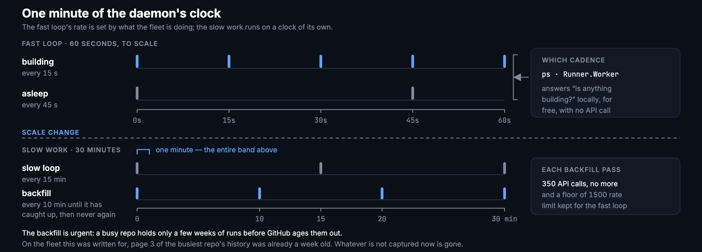

# Architecture

## Overview

The fleet is a collection of shell scripts, a Node daemon, and the GitHub
runner binary — one runner process per repo, each living in its own directory.
There is no container orchestration, no Kubernetes, and no cloud control plane.
The unit of deployment is a macOS user account.

```
~/actions-runners/                  ← fleet root
├── fleet.env                       ← host-local overrides (optional)
├── project-ios/                    ← one runner directory per repo
│   ├── .runner                     ← runner config and credentials
│   ├── .env                        ← PATH and hook env vars
│   ├── _work/                      ← job checkouts and build output
│   └── _diag/                      ← runner diagnostic logs
├── project-web/
├── project-backend/
│   ...
└── dashboard/
    ├── fleetd.js                   ← the daemon
    ├── fleet.db                    ← SQLite: runs, jobs, runner state
    └── public/                     ← browser UI (plain HTML+JS, no build step)
```

## Component diagram


The **collector** polls GitHub and probes the machine. The **server** answers
the browser. They are one process because they share the snapshot in memory:
the live view never polls for it, and there is one LaunchAgent to reason about
at 3 am rather than two.

Everything inside the host boundary runs under launchd, which is not a
deployment preference. `gh` keeps its token in the login keychain, and a
non-login session cannot read it — `gh auth status` reports an invalid token
over SSH while working fine in the GUI session. LaunchAgents do get keychain
access, so running under launchd **is** the auth mechanism, and
`./fleetctl.sh run` over SSH will fail to get a token unless you pass
`GH_TOKEN=…` yourself.

## The loops



Whether to poll fast is decided from the **local** `Runner.Worker` check, which
answers "is anything building" for free and with no API call. The backfill walks
back through every run GitHub still holds; it is throttled to a bounded number
of calls per pass and keeps a rate-limit floor for the fast loop, because run
and job detail is the record GitHub deletes and nobody can recover. Every
interval here is configurable — see
[Dashboard daemon variables](configuration.md#dashboard-daemon-variables).

## Data flow and trust boundaries

There are three boundaries on the diagram above, and they are not equally
trusted:

| Boundary | What crosses it | What is assumed |
|---|---|---|
| GitHub to this host | Job dispatch over HTTPS, and the daemon's polling | GitHub is trusted to dispatch only jobs from repos you registered a runner for. A fork's pull request against a **public** repo is a job you did not write — see [Security](security-hardening.md) |
| The host to the browser | The SSE snapshot out, actions in | Read access and the right to restart runners are different things. Reads are open on loopback; every action needs the bearer token, which is stored in the browser and never served to the page |
| Another Mac to this host | An outbound heartbeat from `agent.js` | The agent opens the connection. No inbound port is opened on it, and the host — not the coordinator — decides what it will run. Deregistration is deliberately not in that set |

Inside the host boundary there is no isolation between runners: they run as one
user, in one account, with one `PATH`. A job that can write to `_work` on one
runner can read `_work` on another. That is the deployment model, and it is why
this is built for private repos with trusted contributors.

## Runner processes

Each runner directory contains the GitHub Actions runner binary. The runner
is managed by a macOS LaunchAgent (`~/Library/LaunchAgents/actions.runner.*.plist`),
which:
- Launches `runsvc.sh`, which launches `RunnerService.js`
- `RunnerService.js` supervises the listener (`Runner.Listener`) and restarts it
  on crash
- The listener waits for jobs and forks a worker (`Runner.Worker`) to run them

LaunchAgents are loaded at login and survive process crashes, but **not**
`RunnerService.js` crashes — that is what `health.sh --repair` fixes.

## Dashboard daemon (fleetd)

`fleetd.js` is a single Node process that does two things:
1. **Collects** state on a timer and stores it in SQLite
2. **Serves** an HTTP API and the browser UI

**Fast loop** (15 s busy / 45 s idle): GitHub API for runs and runners, plus
local probes (launchctl, ps, vm_stat, df).

**Slow loop** (15 min): repo roster, directory sizes, forecast evaluation.

**Backfill** (every 10 min until caught up): historical runs and job timings.

The fast and slow loops share one in-memory snapshot. The server reads from
this snapshot; there is no per-request database read for the live view.

## Hooks

The job hooks (`ACTIONS_RUNNER_HOOK_JOB_STARTED` and
`ACTIONS_RUNNER_HOOK_JOB_COMPLETED`) run inside the runner process:

- **job-started**: checks the admission gate (if `enforce` mode), then exits 0
  to allow the job to proceed. A non-zero exit would cancel the job.
- **job-completed**: checks for a `.drain-stop` file left by `drain-runner.sh`;
  if found, stops the service once the worker has exited.

Neither hook is installed by default. `scripts/install-hooks.sh --apply` wires
them up.

## SQLite database

`fleet.db` stores:
- **runs** and **jobs**: append-only; kept forever (GitHub discards run detail
  after 90 days — this is the only long-term record)
- **runner_state**: one row per runner, updated each fast loop
- **host_samples**: 1-minute host vitals (load, memory, swap, disk)
- **queue_events**: queue-cause transitions per queued run
- **forecast_evals**, **autoscale_decisions**, **admission_log**: decision records
- **hosts**, **host_heartbeats**, **host_commands**: federation

Schema is managed by forward-only migrations in `lib/db.js`. There is no
downgrade path — back up `fleet.db` before upgrading.

## Autofix and admission

`autofix/` runs inside each job's started hook, keyed on the admission module.
`autofix/escalate/` is an optional third-party subtree that must be opted into
separately (see [Security Hardening](security-hardening.md)).

## What the control token is worth

The dashboard's control plane executes shell commands as the current macOS
user, which is the same user running the runners. That is intentional — the
actions *are* the existing scripts, which keeps them the single source of truth
rather than forking their logic into a web app.

The consequence is worth stating plainly: **the control token grants the same
access as an SSH session to that user.** Protect it accordingly. It is stored
in the browser, is never served to the page, and `FLEET_READ_ONLY=1` removes
the control plane entirely. What bounds it beyond that is that every action is
`execFile` with an argv array against an entity the daemon already discovered —
see [The control plane](design/control-plane.md).

## Agents (federation)

When a second Mac joins the fleet, `agent.js` runs on it and reports outbound
to the coordinator dashboard. No inbound port is needed on the agent host. The
coordinator never initiates a connection to agents; commands flow back via the
polling response to the agent's heartbeat.

See [Federation](federation.md) for the operational details.
