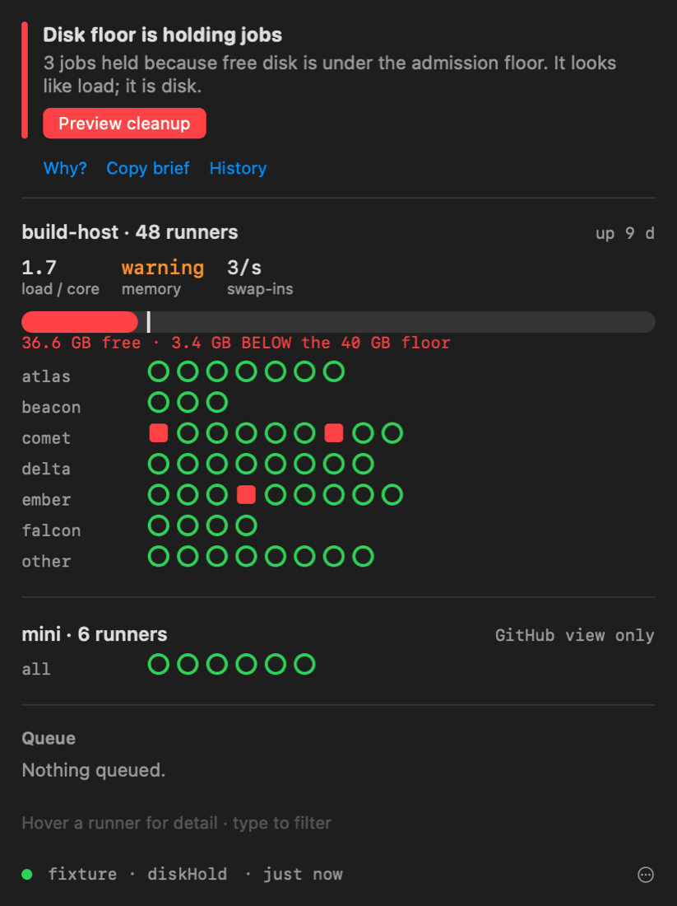
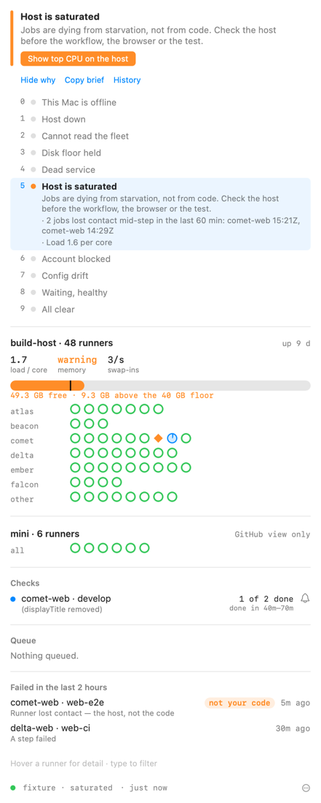

# Fleet Cockpit

Fleet Cockpit is a macOS menu bar app for the Mac you sit at. It shows the
fleet's verdict at a glance, keeps telling the truth when the runner host or its
dashboard is the thing that is down, and gives scripts and agent sessions one
command in place of a diagnostic ladder.

It is a client of the dashboard, not a second monitoring engine. Everything it
says about the fleet comes from [`GET /api/glance`](api.md#get-apiglance); the
only thing it works out for itself is what no process on the runner host can
report — that host's own absence.



## What it shows

**The menu bar** carries one mark for the verdict, and optionally the number of
running (`▸`) and queued (`◷`) jobs.

**The popover**, top to bottom:

- **The verdict** in words, with one button for the next move — *Preview
  cleanup* when the disk floor is holding jobs, *Health check and repair* for a
  dead service, *Open billing* for an account block.
- **Everything else that is open**, one line each, in ladder order.
- **One lane per host.** The coordinator first, with load per core, memory
  pressure, swap-in rate and a disk gauge that draws the admission floor on it.
  Runners registered on machines the dashboard does not supervise get a lane of
  their own marked *GitHub view only*.
- **A pill per runner**, grouped by project. The shape carries the state, so the
  grid reads the same without colour:

  | Pill | State |
  |---|---|
  | hollow ring | idle |
  | filled arc | busy; the arc is elapsed time against the workflow's usual duration |
  | ring with a dot | held for an admission slot, which is normal |
  | square | held by the disk floor |
  | dashed ring | offline for under five minutes, which usually self-resolves |
  | cross | offline for longer, or the runner service is dead |
  | diamond | lost contact mid-job in the last hour |
  | arrow | draining |
  | question mark | misconfigured (orphan, label mismatch) |
  | hatched | its host is not reporting |
  | dotted | state unknown |

  Hover a pill for its detail; click it to open its running job on GitHub.
- **Checks**: every commit with checks still running (or finished red) as one
  row — "comet-web PR #96 · 2 of 5 done · done in 11m–26m". The bell notifies
  you when that commit's checks finish, green or red, and says *not your code*
  when the host or the account failed them.
- **The queue**, oldest first, with the classifier's cause in plain words and,
  where one can be given, when the run should start and finish — a p50–p90
  range from the job ahead of it and this workflow's history. A run whose cause
  never clears on its own says *won't start on its own* instead of a number.

When the stream drops, the last view stays on screen, greyed, with its age. It
never stays green.

## When the dashboard does not answer

After 20 seconds of failed reconnects the cockpit starts asking three other
witnesses, once a minute, until the stream is back:

- **Can this Mac reach the host's SSH port** on any of the configured aliases
  (resolved with `ssh -G`, so it goes where ssh would)?
- **What does GitHub say about the host's runners?** A few of them, taken from
  the last good view, checked with your own `gh` credential — asked for when
  needed and never stored.
- **Is a runner on a different machine online?** One from a *GitHub view only*
  lane. If it is, the house has power and network, and the problem is the host.

When SSH answers, it also asks the host when it booted, who owns the console,
and whether the dashboard answers locally. The answers are read against one
table:

| SSH | GitHub: host's runners | Other machine | Verdict |
|---|---|---|---|
| no | offline | online | **Host asleep, off or off the network.** Only someone there can wake it. |
| no | offline | offline | **Home network or power is out.** |
| no | offline | — | **GitHub Actions is having trouble**, when githubstatus.com reports an Actions incident |
| yes | offline | — | **Rebooted and nobody has logged in** when the console belongs to nobody (no auto-login strands every LaunchAgent); otherwise **every runner service is down** |
| yes | online | — | **Dashboard down, fleet working.** Restart the dashboard. |
| no | online | — | **Fleet working, out of reach from here.** |
| no GitHub and no SSH | | | **This Mac is offline.** |

These verdicts notify once when they open and once when they clear, with how
long they lasted.

## Why, and the brief




**Why?** under the verdict opens the whole ladder with the verdict's rung lit,
the evidence under it, and every other rung that is currently true.

**Copy brief** puts a markdown incident brief on the clipboard: the verdict,
its evidence and next move, everything else open, host vitals, any runner that
is neither idle nor busy, the queue and open alerts. It is written to paste
into an agent session or an issue.

Below the queue, **Failed in the last 2 hours** lists red runs with the reason
the daemon recorded, and marks the ones that were the host's or the account's
doing — lost runner, refused by billing, storage quota — as *not your code*.

## History and standing risks

**History** under the verdict opens a timeline of the last 24 hours or 7 days,
one lane per failure mode, with today's line — how long jobs waited against how
long they ran, how long admission held them, how many the host lost — the
week's time to clear, and any runner that keeps losing jobs. Under the
coordinator's lane, sparklines show two hours of load per core, swap-ins and
free disk with the floor drawn in, and the disk gauge says when the floor will
be reached at the current rate. Every Monday at 09:00 a digest notification
sums up the week.

**Standing risks** (the orange link) are conditions that are fine today and
have caused an outage before — Spotlight indexing the runner work trees, no
auto-login, sleep, missing hooks, version drift, workflows still on
GitHub-hosted macOS. Each says what to do and who can do it; several are
system settings only you can change.

When disk is a worry, **What is using disk?** runs the cleanup preview (it
deletes nothing). When the host is busy, **Top CPU on the host** lists the top
processes over SSH and names Spotlight outright when it is the culprit
(`cockpit top` does the same). A runner's panel can save its redacted
**diagnostic bundle** to Downloads.

## Acting on it

The cockpit is read-only until you pair it. **Settings → Control → Pair this
Mac** runs `fleetctl.sh pair` on the host over your first SSH alias, exchanges
the six-digit code for this Mac's own device token, and keeps that token in the
Keychain. The master token never leaves the host; revoke the cockpit like any
paired phone with `./fleetctl.sh devices` and `./fleetctl.sh revoke <key>`.
`open fleetcockpit://pair` does the same from a terminal.

Once paired, buttons come from the dashboard's own action catalogue
(`GET /api/actions`), with its labels and its confirmation text:

- the verdict's next move — **Health check and repair**, **Preview cleanup**
  (which then offers **Apply cleanup**, confirmed inline);
- **click a runner** for its recent jobs and state changes, its last `_diag`
  error, and **Restart**, **Drain** or **Resume** it.

Registering, duplicating and removing runners are left to the web dashboard's
Control tab, which previews them.

## Notifications

Alerts from the dashboard notify on transitions, the same ones the dashboard
itself fires: once when a condition opens, once when it clears with how long it
lasted. Conditions already open when the app starts are not re-announced, and
more than five opening at once (a host restart) arrive as one summary.

Notifications carry buttons: **Repair** on dead or offline runners, **Dismiss
everywhere** (the web dashboard and phone push stop too), **Snooze 1 hour**
(this Mac only) and **Open dashboard**. Critical alerts are time-sensitive and
break through Focus. In Settings you can notify for critical only, set quiet
hours during which only critical alerts notify, and mute rules by name.

## Around the system

- **Desktop widgets** (small, medium, large): the verdict, a dot per runner, and
  the checks and queue. They read the snapshot the app shares through its app
  group and never touch the network; a view older than ten minutes says so.
- **Shortcuts and Spotlight**: *Fleet Status*, *Why Is a Repo Queued* and *Repair
  Fleet* (which asks first, and needs a paired Mac).
- **Focus filter**: in a Focus's settings, choose whether fleet alerts reach you
  during it — critical and warning, critical only, or none.
- **⌃⌥⌘F** opens the popover as a floating window for a second display during
  an incident, from anywhere; the footer menu does the same.
- **Incident replay** (footer menu) steps through the recorded incidents — the
  disk-floor freeze, a dead service, the saturated host, a billing block — with
  the real popover, one recorded state at a time.
- Optionally, a sound when a watched commit goes green.

The web dashboard shows the same verdict as a banner above its KPI row, with the
next move as a button and the evidence under **Why**.

## From another machine: the host sentinel

The cockpit can only watch while this Mac is awake. `scripts/host-sentinel.sh`
runs on a second machine in the same house (a Mac mini, say) every minute and
posts to [ntfy](https://ntfy.sh) when the runner host stops answering — asleep,
off, or rebooted with nobody logged in — and again when it is back. With a
userspace tailscaled it probes with `tailscale ping`; otherwise with a TCP check
of port 22. Messages carry the host's name and nothing else.

```bash
# on the other machine
printf '%s\n' 'SENTINEL_NAME=runner-host' 'SENTINEL_TARGET=runner' \
  "SENTINEL_NTFY=https://ntfy.sh/fleet-$(openssl rand -hex 12)" > ~/.config/fleet-sentinel.env
chmod 600 ~/.config/fleet-sentinel.env
scripts/host-sentinel.sh --test-notify   # subscribe to the topic in the ntfy app first
scripts/host-sentinel.sh --install
```

## Agent sessions

- `cockpit mcp` is an MCP server with four read-only tools — `fleet_status`,
  `why_queued`, `fleet_queue`, `wait_for_checks`. Register it with
  `claude mcp add --scope user fleet-cockpit -- ~/.local/bin/cockpit mcp`.
- `cockpit/skills/fleet-cockpit/SKILL.md` teaches a session when to reach for
  them.

## Releases

`.github/workflows/cockpit-release.yml` builds, signs with a Developer ID
certificate, notarizes and publishes a DMG and the CLI on a `cockpit-v*` tag.
It does nothing until the signing secrets listed at its top are set on the
repository.

## Getting it

Build it from the repository. It needs Xcode 16 or later, macOS 14 or later,
and [XcodeGen](https://github.com/yonaskolb/XcodeGen).

```bash
cd cockpit/App
cp Local.xcconfig.example Local.xcconfig   # optional: your signing identity and team
xcodegen generate
xcodebuild -project FleetCockpit.xcodeproj -scheme FleetCockpit -configuration Release build
```

Without `Local.xcconfig` the app is signed ad hoc, which runs on the Mac that
built it.

To have it open at login, use **Settings → System → Open at login**, or from a
setup script (applied once at the next launch, then cleared):

```bash
defaults write io.github.addisdev.fleetcockpit pending.loginItem -bool YES
```

## Reaching the dashboard

The dashboard binds to loopback on the runner host. The cockpit's default route
needs nothing changed there: it opens `ssh -L` through aliases from your
`~/.ssh/config`, trying each in turn (by default `runner-host`, then
`runner-ts` for a tailnet route). Key-based login only; `BatchMode` makes an
alias that would prompt fail fast instead of hanging.

The tunnel runs `cat` on the host, fed from a pipe only the app holds, so
however the app ends the tunnel ends with it.

If you serve the dashboard over [Tailscale Serve](remote-access.md#tailscale-remote-access-over-your-tailnet)
or the LAN, choose *Direct URL* in Settings instead.

The app reconnects with jittered backoff (1 s doubling to 30 s), immediately on
wake from sleep, and immediately when the network changes.

## Fixture mode

Every recorded incident the verdict is tested against ships inside the app as a
fixture: `live`, `quiet`, `waiting`, `dead`, `diskHold`, `diskBelowIdle`,
`saturated`, `accountBlocked`, `drift`, `agentDown`, `blind`. Pick one in
Settings, or launch with `--fixture <name>`. Fixture mode never writes the
snapshot file.

`--render <file.png>` draws the popover for a fixture and exits, which is how the
screenshots on this page are made:

```bash
"Fleet Cockpit.app/Contents/MacOS/Fleet Cockpit" --fixture diskHold --render disk.png [--dark] [--hover ember-ios]
```

## The command line

`cockpit` reads the app's live view when it is fresh (under 90 seconds old) and
otherwise opens its own tunnel.

```bash
cd cockpit
swift run cockpit status            # the verdict, one screen
swift run cockpit status --json     # the same, for scripts
swift run cockpit status --fixture saturated
swift run cockpit sentinel          # the out-of-band check, from this Mac
swift run cockpit brief             # the markdown incident brief
swift run cockpit pair              # a separate, revocable token for the command line
swift run cockpit run fleet.health  # a catalogue action; anything that changes the fleet needs --yes
```

The command line keeps its token in
`~/Library/Application Support/FleetCockpit/cli-token-*` (mode `0600`) rather
than the Keychain: SwiftPM builds are signed ad hoc, so every rebuild would
otherwise meet a Keychain prompt.

```bash
cockpit why comet-web               # one repo: runners, queue with causes and ETAs, checks, failures, alerts
cockpit queue                       # every queued run with cause and ETA
cockpit wait comet-web --pr 96      # block until PR #96's checks finish
```

`cockpit wait` is built for scripts and agent sessions that would otherwise run
`gh pr checks --watch`. It exits `0` when the checks are green, `1` when one
failed (listing which), `2` as soon as waiting is pointless — the host is down,
the disk floor is holding jobs, GitHub is refusing jobs for billing, or one of
the checks is queued with a cause that never clears — and `3` on timeout
(`--timeout 45m` by default).

Exit codes for `status` and `why`: `0` fine or healthy waiting, `1` a real
fault, `3` nothing could be read.

`cockpit/skills/fleet-cockpit/SKILL.md` is a Claude Code skill that teaches an
agent session to reach for these before blaming a workflow or a test; copy it
into `~/.claude/skills/`.

## The snapshot file

The app writes its current view to
`~/Library/Application Support/FleetCockpit/glance.json` (mode `0600`) on every
update: the verdict it is showing, the route, the connection state, and the
glance itself, stamped with `writtenAt`. Other tools can read it without
touching the network; treat a `writtenAt` older than 90 seconds as a dead app.
