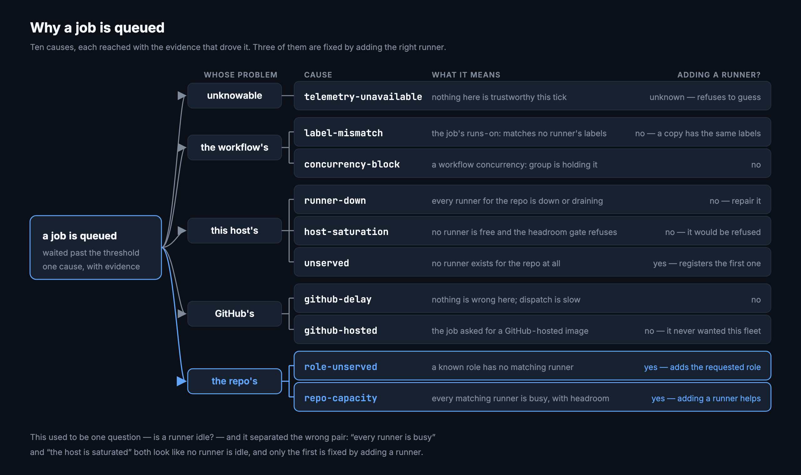

# Concepts

This page introduces the ideas the rest of the handbook assumes: what a runner
is on this system, what launchd does and does not do for it, what drift means,
why a job is queued, how admission control differs from autoscaling, where
group headings come from, and why alerts fire when they do. Every guide here
takes these as read. Read this once and the rest of the handbook stops
referring forward.

## A runner is a directory and a LaunchAgent

There is one runner per repo, and a runner is two things: a directory under the
fleet root, and a macOS LaunchAgent that keeps a process running out of it.
There is no container, no orchestrator, and no cloud control plane. **The unit
of deployment is a macOS user account** — the runners, the dashboard and the
scripts all run as one user on one Mac.

A single runner directory holds:

```
~/actions-runners/project-ios/
├── .runner        ← which repo this runner serves, its name, its labels
├── .credentials   ← the private key that authenticates it to GitHub
├── .env           ← the PATH and hook environment the service starts with
├── _work/         ← job checkouts and build output
└── _diag/         ← the runner's own diagnostic logs
```

`_work/` is kept between jobs — every runner in the fleet is persistent, so
checkouts and build caches survive from one job to the next. It also holds
whole checkouts of private repositories plus whatever a job wrote to disk,
which is why the diagnostic bundle is built from an allowlist rather than a
denylist.

`register.sh` creates both halves in one pass: `config.sh` writes the
registration into the directory, then `svc.sh install` writes the LaunchAgent
plist to `~/Library/LaunchAgents/actions.runner.*.plist` and `svc.sh start`
loads it. Nothing is registered that is not also loaded, and nothing is loaded
that is not also registered — when those two facts come apart, that is drift.

A second runner for the same repo is a second directory and a second
LaunchAgent, distinguished by instance number (`RUNNER_INSTANCE=2`). The first
runner is always instance 1. Instance numbers matter later: the autoscaler
never removes instance 1.

What a runner costs is worth knowing before you add one. An idle listener is
about 7 MB of memory. Its directory is 1.3–2.3 GB of disk. The expensive part
is not the runner, it is the job it accepts.

For the full directory tree and the component map, see
[Architecture](architecture.md).

## What launchd will and will not do for it

The plist starts a chain: launchd runs `runsvc.sh`, which runs
`RunnerService.js`, which supervises the listener (`Runner.Listener`), which
waits for jobs and forks a worker (`Runner.Worker`) to run each one.

The supervision only goes one level deep. `RunnerService.js` restarts the
listener if the listener crashes. Nothing restarts `RunnerService.js`.

**No runner plist sets `KeepAlive`.** launchd loads the job at login, starts
it, and then does nothing further. A crashed or OOM-killed `RunnerService.js`
is never revived, and the only symptom is that one repo's jobs queue forever
while every other repo looks completely fine.

That is the single most important fact on this page. It is a silent failure
with a slow tell, which is why `health.sh` exists and why `health.sh --repair`
is the response to three separate alert conditions. It is also the difference
between the runner plists and the fleet's own: the dashboard, autofix and watch
LaunchAgents all set `KeepAlive` deliberately, because a watchdog that dies
quietly is worse than no watchdog.

Two dashboard badges name the two ways this shows up:

- `dead` — the LaunchAgent is loaded but the process is not running. This is
  the case above.
- `not-loaded` — the LaunchAgent is not loaded at all, or the runner was never
  registered.

See [Operations → Health check](operations.md#health-check) for the repair, and
[Troubleshooting → A runner shows `dead` in
launchd](troubleshooting.md#a-runner-shows-dead-in-launchd) for the
investigation.

## Drift: when this machine and GitHub disagree

Drift is the set of states where this machine and GitHub disagree. Each one is
silent from whichever side you happen to be looking at.


| Kind | What it catches |
|---|---|
| `launchd-missing` | registered on GitHub, no LaunchAgent loaded — jobs queue forever |
| `launchd-dead` | job loaded but not running; no runner plist sets `KeepAlive`, so launchd will not revive it |
| `offline` | listener alive locally, GitHub says offline |
| `orphan` | running here, deregistered on GitHub — it will never receive a job |
| `label-mismatch` | sibling runners with different extra labels; the odd one out never matches `runs-on:` |
| `stuck-queue` | queued 5+ min while a runner for that repo sits idle |

Two things are deliberately **not** drift, because each has its own section and
listing them twice buries the rows that need acting on: repos with workflows
and no runner here, and runners registered on another machine.

The silence is the whole point. An orphan is a healthy process on a healthy
machine — `ps` shows it, launchd is happy, and it will never be offered a job
again. A `launchd-missing` runner is still registered on GitHub, so the repo
looks served from that side, while there is nothing loaded on this host to
receive the work. Neither side is lying; neither side can see the other. Drift
is the only view that holds both at once, which is why the dashboard collects
the local probes and the GitHub API on the same tick rather than trusting
either alone.

## Why a job is queued

A queued job used to produce one drift row — "stuck in the queue" — with a
single question behind it: is a runner idle? That separated two of the seven
reasons a job can wait, and it separated the wrong pair. "Every runner is busy"
and "the host is saturated" both look like *no runner is idle*, and only the
first is fixed by adding a runner. Duplicating a runner into the second case
adds a runner the headroom gate would have refused.

[`lib/queue-cause.js`](https://github.com/addisdev/actions-runners/blob/main/dashboard/lib/queue-cause.js)
classifies each queued run instead, with the evidence it used and a confidence
level.



| Cause | What it means | Adding a runner helps? |
|---|---|---|
| `telemetry-unavailable` | A GitHub call failed or the rate limit is nearly spent, so nothing here is trustworthy | Unknown — refuses to guess |
| `unserved` | No runner exists for the repo at all | Register one |
| `label-mismatch` | The job's `runs-on:` matches no runner's labels | **No** — a copy has the same labels |
| `runner-down` | Every runner for the repo is offline, dead or draining | No — repair it |
| `concurrency-block` | An idle runner exists and the run is still not dispatched; a workflow `concurrency:` group is holding it | No |
| `host-saturation` | No runner is free and the headroom gate is refusing additions | No — it would be refused |
| `repo-capacity` | Every runner for the repo is busy, and there is headroom | **Yes** |
| `github-delay` | Nothing is wrong here; dispatch is slow | No |

The order is the classification order, most definitive first, so a run that
could be described two ways gets the structural explanation rather than the
inferential one.

Confidence goes with the cause: **high** means structural proof (no runner
exists, the labels do not match, every probe was present), **medium** means
corroborated but not definitive, **low** means indirect evidence only —
everything looks fine and the job is still queued.

Two causes are inferences rather than proofs, and the classifier says so. The
API exposes no concurrency-slot state, so `concurrency-block` is reached by
elimination: an idle online runner exists and the run has waited longer than
dispatch normally takes. And the API exposes no dispatch-reason field, so
`github-delay` is strong circumstantial evidence rather than a verdict.

**Only `repo-capacity` at high confidence lets the autoscaler act**, and only
that combination shows an **Add a runner** button. This is the concrete failure
it prevents: cloning a runner whose labels do not match produces a second
runner that also never matches, which is how one idle runner became two.

Causes are persisted as *transitions* in `queue_events`, not once per tick, so
"how long was this a label mismatch before anyone noticed" is answerable
without storing a value that rarely moves.

## Admission control is not autoscaling

They sound like the same feature and they are not:

- **Admission control** gates *running jobs*. It holds a job at the runner's
  `ACTIONS_RUNNER_HOOK_JOB_STARTED` hook, before the job's first step, until a
  concurrent execution slot is free. It acts inside a job.
- **Autoscaling** changes the *number of runners*. It registers a runner when a
  repo is under-provisioned and removes idle duplicates. It acts between jobs.

Both are off by default. You can run either, both, or neither.

The reason the distinction matters: **nothing in the dashboard throttles
execution.** There is no scheduler. Every registered runner listens
independently, so if 27 of them are offered work in the same second, 27 jobs
start. The only mechanism that can stop that is the job hooks, which live
outside the dashboard.

The setting names invite the opposite reading, so they are worth stating
plainly:

| Setting | What it actually does |
|---|---|
| `maxTotalRunners` | The real cap on concurrency, because it caps how many runners can exist |
| `ceiling` | Refuses to *add* a runner while this many jobs are running. Does not stop a burst across runners that already exist |

Adding a runner does not add capacity; it adds concurrency on fixed capacity.
That is sometimes exactly what you want — a repo with one runner and two jobs
is waiting for no reason — and sometimes it is how a 12-core machine ends up
with a load average in the hundreds.

For how to install the hooks, the three admission modes, and the autoscaler's
gates, see [Admission and scaling](admission-and-scaling.md). For why the
thresholds are what they are, see [Capacity and
autoscaling](design/capacity.md).

## Groups are inferred, not configured

Runners and repos are grouped so that `app-ios`, `app-web` and `app-backend`
appear under one `app` heading. Nothing configures this: a repo name is split
on `-`, `_` and `.`, and any first token shared by two or more repos becomes a
group. Repos that share nothing with anything land under `other`.

The rule is the dullest one that works. Run against a real 34-repo fleet it
produced exactly the groups a person would have drawn by hand, and raising the
threshold from two to three changed none of them — so there is no cleverness
here to go wrong later.

**The names come from disk and from SQLite, never from the current tick.**
Groups derived from one tick's API results dissolve the moment a call fails,
and a heading that disappears and comes back moves every tile beneath it. This
was verified by running the collector with every GitHub call returning 401: the
grouping came out byte-identical to a healthy run.

Only repos the fleet has something to do with get a vote — those with a
workflow or a runner. An account full of boilerplates otherwise decides the
layout.

There are four escape hatches, all optional and all off by default:
`FLEET_PROJECTS`, `FLEET_GROUP_IGNORE`, `FLEET_GROUP_MIN` and `FLEET_GROUPS`.
See [Configuration → Grouping
variables](configuration.md#grouping-variables) for what each one takes, and
[Inferred groups](design/groups.md) for the reasoning in full.

## Alerts fire on transitions, not levels

A rule evaluated every 15 seconds that notified whenever it was true would send
240 notifications an hour for one dead runner, and the second one would already
be ignored. So each condition opens once, closes once, and is stored as an
interval — which also makes "how long was it down" a fact rather than a guess,
and lets a daemon restart reload what was already open instead of re-announcing
it.

Two more things stop it becoming noise:

- **Sustain windows.** Disk and paging cross their thresholds constantly during
  a build and come straight back. A threshold measures the sample; a threshold
  plus a duration measures the problem.
- **A storm guard.** A reboot puts every runner down at once. Past five at a
  time it sends one notification saying how many, because sixteen is not
  sixteen times more useful than one.

**There is deliberately no load-average rule.** Measured on this host, a single
ordinary Xcode build drives load past 100 on 12 cores. Alerting on that would
fire on healthy behaviour every day, which is how people learn to ignore
alerts. The same reasoning removed a swap-level rule.

What does fire: a runner dead, missing its LaunchAgent, or offline; an orphan;
a sibling label mismatch; a run stuck in the queue; disk low; sustained paging
or kernel-reported memory pressure; the collector unable to reach GitHub; and a
workflow that was green and just went red. Those are the drift kinds above plus
the host conditions — the alerting rules and the drift table are deliberately
the same vocabulary.

See [Alerts and autofix](design/alerts.md) for what happens after an alert
opens.

## Where to go next

- [Get started](getting-started.md) — register the first runner and bring up
  the dashboard.
- [Dashboard](dashboard.md) — every tab, badge and action, now that the badges
  mean something.
- [Troubleshooting](troubleshooting.md) — symptom to cause to fix, organised by
  what you saw.
- [Design notes](design/index.md) — why each of the above is built the way it
  is, with the measurements behind it.
