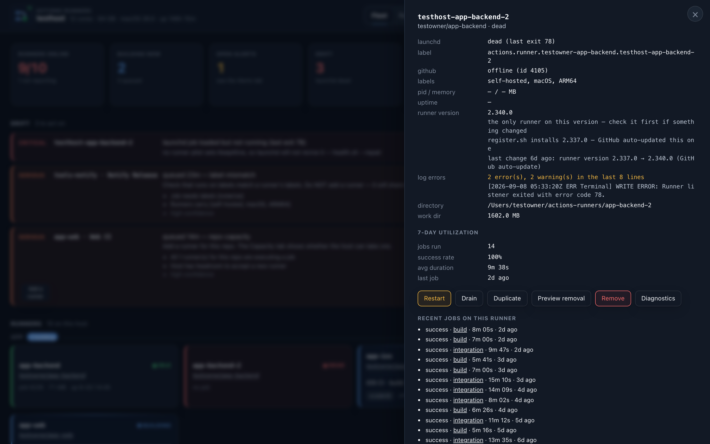
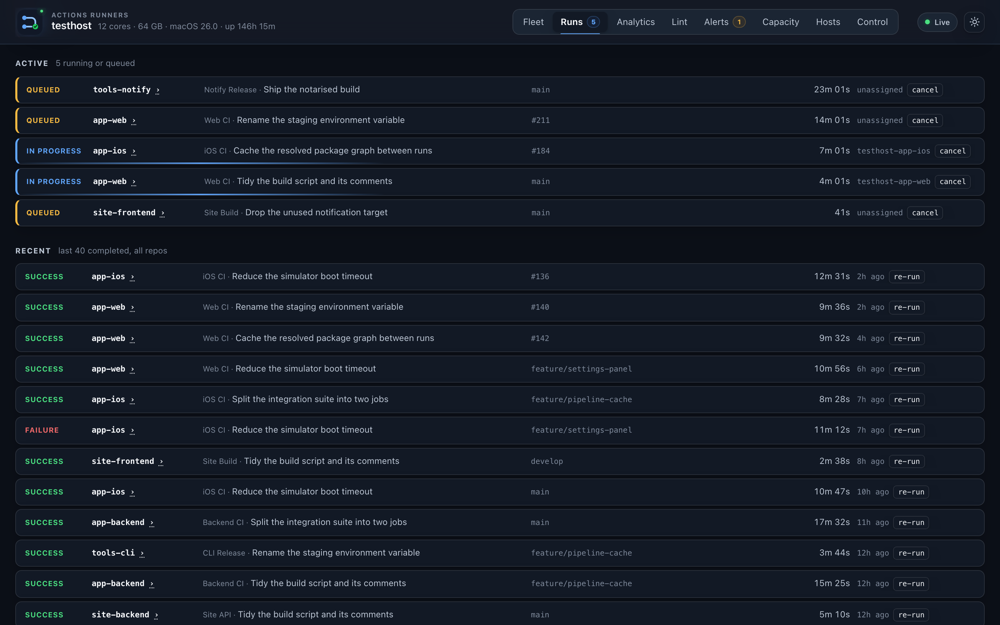
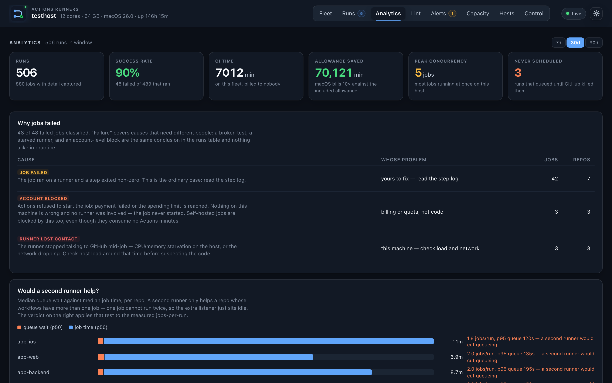
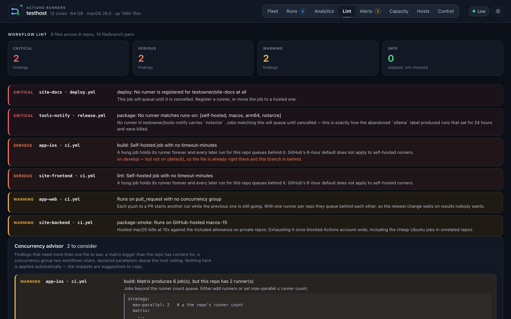
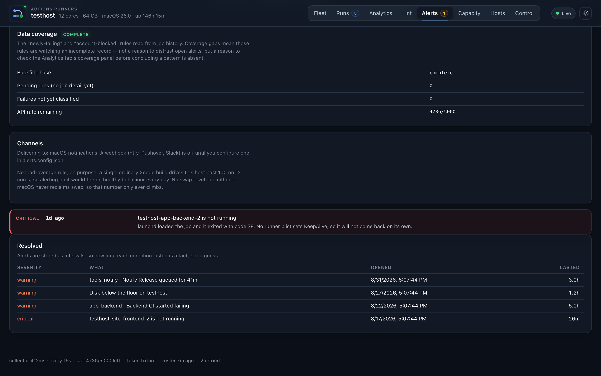
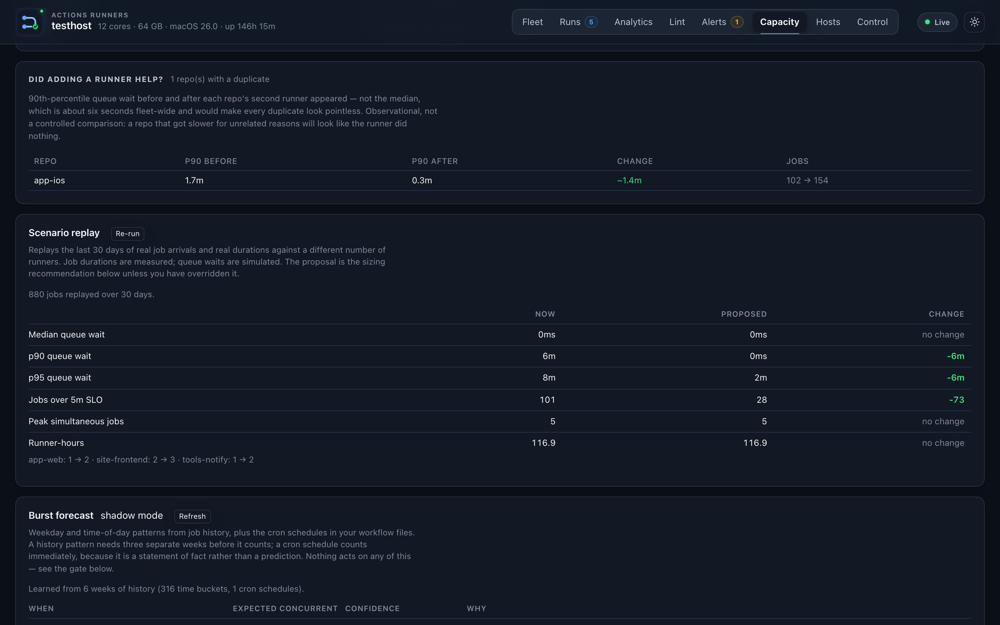
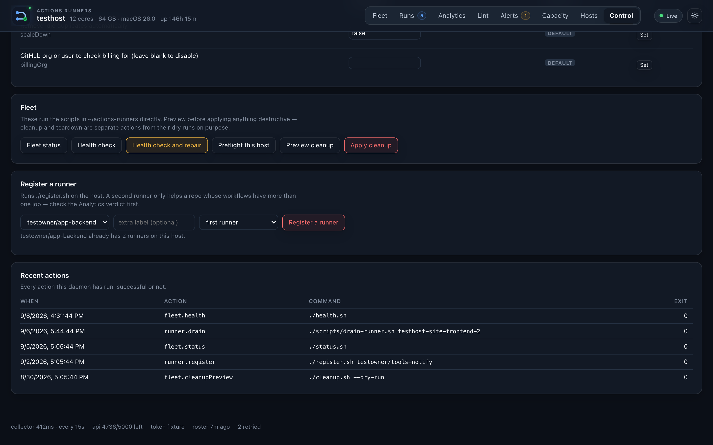
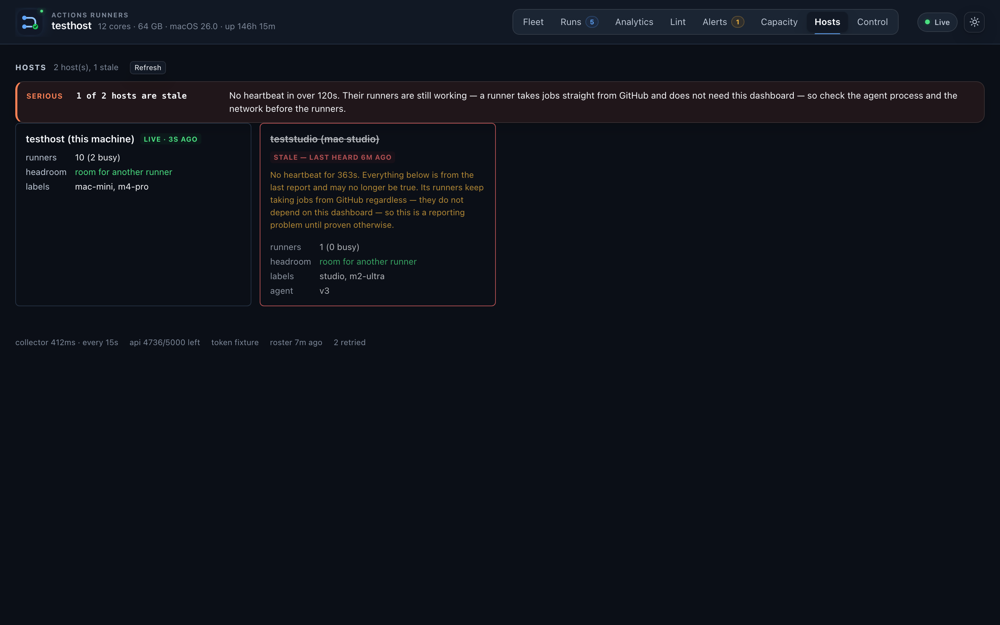

# Dashboard

The dashboard is a single-page web app served by `fleetd.js`, a Node daemon
that runs on the same machine as your runners. Open
[http://localhost:7878](http://localhost:7878) after installing it.

For installation, see [Get started → Install the dashboard](getting-started.md#5-install-the-dashboard).

!!! note "The screenshots on this page are a fixture fleet"

    Every repository, host and runner name below is invented, and the numbers
    come with them. They are the real interface rendering fixture data, so that
    a screenshot of the Analytics tab cannot be mistaken for a measurement.
    `docs/tools/shoot-dash.mjs` builds the fleet and captures them; the two
    images in the README that *are* from a live fleet say so where they appear.

## Tabs

### Fleet

The main view. Shows every registered runner grouped by project, with live
status badges.

**Summary tiles** — the eight cards across the top are live operational
snapshots. Each is a button: clicking (or pressing Enter/Space) navigates
directly to the most relevant tab and scrolls to the related section. No URL
changes — navigation is in-app only.

| Tile | Navigates to |
|---|---|
| Runners online | Fleet → runner grid |
| Building now | Runs → active jobs |
| Queued | Fleet → queued jobs |
| Open alerts | Alerts |
| Drift | Fleet → drift section |
| Memory pressure | Capacity |
| Load | Capacity |
| Disk free | Capacity |

**Runner status badges:**
| Badge | Meaning |
|---|---|
| `busy` | A job is running (`Runner.Worker` process detected) |
| `online` | Registered, service running, no active job |
| `offline` | Registered on GitHub but process not detected |
| `draining` | Scheduled to stop after its current job |
| `drained` | Stopped intentionally; will not take new jobs |
| `dead` | LaunchAgent loaded but process not running |
| `not-loaded` | LaunchAgent not loaded (or runner not registered) |
| `unknown` | GitHub API could not be reached for this runner |

Click any runner to open the **runner drawer**: recent events, job history,
version info, diagnostic log summary, and action buttons.

**Drift alerts** appear under a runner when the local and GitHub states
disagree — for example, the service is running but GitHub says the runner is
offline, which usually means a registration that needs re-running.

### Runs

Live and recent runs across all repos. Job status, duration, and runner
assignment. Click a run to open it on GitHub.

**Queue diagnosis**: queued jobs on both the Fleet and Runs tabs show the
classifier verdict inline — cause, confidence, recommended action, and an
evidence list you can expand. The same diagnosis drives autoscale eligibility
(`autoscale eligible` chip when adding a runner would help).

**Long-running jobs**: when the snapshot marks an in-progress run with
duration hints (`expectedDurationMs`, `p95DurationMs`, or a `longRunning`
flag), the Runs tab shows an orange chip once elapsed time exceeds the
expected duration.

**Remediation panel**: the Fleet and Runs tabs list recent failure candidates
from `GET /api/remediation-candidates` — what the autofix bridge may rerun or
escalate. An empty list means nothing is pending; a fetch failure hides the
panel gracefully.

**Live connection**: the header dot reads `Live` only while the collector is
fresh. Once the snapshot age exceeds the collector staleness threshold (four
minutes by default, same as `GET /api/health`), the dot turns amber and the
label reads `Stale` or `Collector stalled` instead of green `Live`.

### Analytics

30-day job history: count, duration percentiles (p50/p95), failure rate, and
runner utilisation per repo. Updated when you open the tab. Not live-streamed.

### Lint

Workflow file analysis across all repos with registered runners. Flags:
- Unbounded matrix jobs (n×m runners needed)
- Missing `concurrency:` groups (parallel-on-push risk)
- Static concurrency group collisions (two workflows blocking each other)
- Matrix parallelism that exceeds the per-repo runner cap

**Concurrency advisor** findings appear here with YAML snippets showing the
suggested fix.

### Alerts

Configurable alert rules for runner offline time, queue depth, error rates,
and more. Configure in `dashboard/alerts.config.json` — see the example in
`examples/alerts.config.json`.

### Capacity

**Sizing panel**: shows the recommended runner count for each repo based on
observed peak concurrent jobs. Toggle autoscaling on/off here.

**Admission panel**: shows the current `FLEET_ADMIT_MODE` and a history of
held/admitted decisions if observe or enforce mode is active.

**Scenario replay**: run "what if we had N runners for repo X" against actual
historical job data. Shows queue wait p95, max queue depth, and SLO compliance.

**Burst forecast**: next-hour demand estimate based on weekday/time-of-day
patterns and workflow schedules. Shadow-only — verifies accuracy against
reality before any action is taken.

### Control

Manual actions: duplicate a runner, deregister one, drain/resume, run a health
check. Every action requires the bearer token (paste once; stored in
`localStorage`). Dangerous actions show a confirmation dialog.

**Action log** at the bottom of the page shows the stdout of the last executed
action.

### Hosts

Federated host view (when agents are configured). Shows every Mac's runners,
load, memory, disk, labels, headroom, drain state, and host-level repair/drain
controls. A host whose heartbeat is stale (>2 minutes old) is flagged in
orange. While the tab is open it refreshes every 30 seconds.

Above the host cards, a **fleet-wide capacity** summary names which hosts
currently have headroom for another runner. **Recent placements** lists the
last autoscale placement decisions (chosen host or refusal reason). **Pending
commands** shows registration, restart, drain, repair, and removal commands
waiting for a host. In PostgreSQL HA mode the global strip also names this
replica's leader/standby role.

When more than one host is connected, the Fleet tab becomes host-first: runners
are grouped by Mac and then by project. Capacity separates **this host** from
**fleet-wide** headroom, and Runs attributes assigned runners to their host.

## Queue diagnosis causes

| Cause | Meaning | Autoscale eligible? |
|---|---|---|
| `telemetry-unavailable` | GitHub or the local probes failed, so nothing here is trustworthy | No |
| `github-hosted` | The job's `runs-on:` names a GitHub-hosted image, so nothing on this fleet applies | No |
| `unserved` | No runner registered for this repo | Only with `provisionUnserved` |
| `label-mismatch` | No runner has all required labels | No |
| `runner-down` | All runners for this repo are offline/drained | No |
| `concurrency-block` | Another job from this run is using the only runner | No |
| `host-saturation` | No runner is free and the headroom gate is refusing additions | No |
| `repo-capacity` | More jobs than runners for this repo | **Yes** |
| `github-delay` | Runner is ready but GitHub has not dispatched | No |

`repo-capacity` with high confidence triggers autoscale, and `unserved` does too
once `provisionUnserved` is on — the one other case where adding a runner is the
remedy rather than a way to make things worse. A label mismatch would only be
made worse by cloning the existing runner.

`github-hosted` is checked before the repo's own runners are considered, because
the answer does not depend on them. It exists because a `ubuntu-latest` job was
being reported as a **critical** label mismatch against runners carrying
`self-hosted, macOS, ARM64` — accurate, and an instruction to go and fix a
workflow that was behaving correctly.

[Why a job is queued](concepts.md#why-a-job-is-queued) explains what each cause
rules out, and [Honest analytics](design/analytics.md) explains how they are
recorded.

## Actions

All actions require the control token in an `Authorization: Bearer` header. The
browser stores this token in `localStorage` after you paste it once.

| Action | Effect | Requires confirmation? |
|---|---|---|
| Duplicate runner | `register.sh` with same labels + `RUNNER_INSTANCE=N+1` | Yes |
| Drain runner | `scripts/drain-runner.sh --drain` | Yes |
| Resume runner | `scripts/drain-runner.sh --resume` | Yes |
| Deregister runner | `scripts/deregister.sh --apply` | Yes |
| Health check | `./health.sh` | No |
| Download diagnostics | Redacted bundle (token-gated) | No |

## Autoscaling

The autoscaler adds runners when the queue classifier returns `repo-capacity`
with high confidence, and removes idle duplicates that have been idle longer
than the configured TTL.

Toggle and configure from the Capacity tab. `dry-run` mode logs decisions
without executing them — run there first.

The autoscaler never touches the instance-1 runner for any repo (it would
remove the last runner, which is never the right outcome).

See [Admission and Scaling](admission-and-scaling.md) for the full policy.

## Diagnostic bundles

The runner drawer's **Diagnostics** button downloads a redacted plaintext
bundle containing the runner's configuration, recent events, job history, and
log summary. The bundle uses an allowlist — only named files are included, and
every line is passed through the secret redactor. Safe to paste into an issue.

The download requires the control token.

## Read-only mode

`FLEET_READ_ONLY=1` disables the control plane entirely. The dashboard is
still live-updating, all read routes still work, and no bearer token exists. Use
this for a LAN-accessible read-only status board where you want to bind to
`0.0.0.0` without granting any write access.

## Security note

Read routes are unauthenticated by design on loopback. This is appropriate for
the default deployment (dashboard on localhost, accessed via SSH tunnel) but
means that anything on the same machine with `localhost` access can read runner
status, job history, and diagnostic log tails. See [Security
Hardening](security-hardening.md) for LAN deployment guidance.
