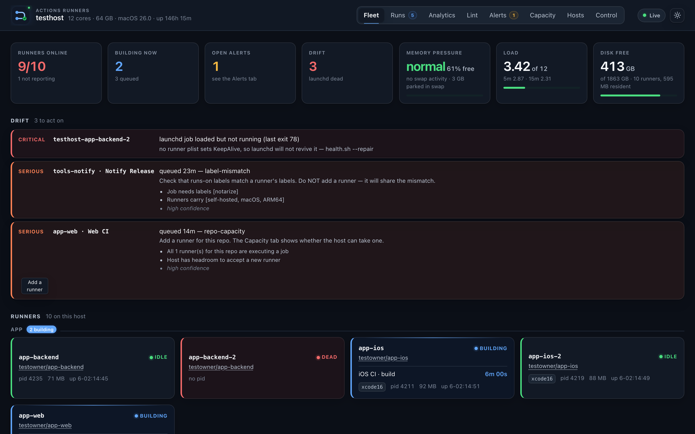

# Get started

By the end of this page you have a runner registered to one of your
repositories, the dashboard running on the same Mac, and a real workflow job
executing on your own hardware while you watch it happen. Budget about five
minutes once the prerequisites are installed; most of that is the 121 MB runner
download, which happens once and is then reused by every runner you add.

This is one machine. There is no cloud control plane, no Kubernetes, and nothing
to sign up for — the runners, the dashboard and its database all live in the
directory you are about to clone.

## Before you start

| Requirement | Version / notes |
|---|---|
| macOS | 14 Sonoma or later, Apple Silicon (`arm64`) |
| [Homebrew](https://brew.sh) | Must be at `/opt/homebrew` (the default arm64 location) |
| [`gh` CLI](https://cli.github.com) | Authenticated to GitHub (`gh auth login`) |
| `python3` | Any version; used by register/status/health/cleanup scripts |
| Node.js | >= 22.5.0 for the dashboard (`node:sqlite` is the requirement) |

!!! warning "Intel Macs are not supported"
    The runner binary is `osx-arm64` only, and the scripts assume Homebrew at
    `/opt/homebrew`. There is no plan to add Intel support.

!!! warning "Self-hosted runners on public repos are a security risk"
    Any fork PR can execute code on your Mac. This project is designed for
    private repositories with trusted contributors. Read the
    [security guide](security-hardening.md) before pointing a public repo at
    your fleet.

## 1. Install the prerequisites

```bash
# Homebrew (if not already installed)
/bin/bash -c "$(curl -fsSL https://raw.githubusercontent.com/Homebrew/install/HEAD/install.sh)"

# gh CLI and Node
brew install gh node@22

# Authenticate gh to GitHub (opens a browser or shows a device code)
gh auth login
```

Verify `gh` works for the repositories you want to run:

```bash
gh api user --jq .login
gh repo list --limit 5
```

If this is a headless server (no browser), use:

```bash
gh auth login --hostname github.com --git-protocol ssh --web
# Follow the device-code prompt
```

## 2. Clone the fleet

```bash
git clone https://github.com/addisdev/actions-runners.git ~/actions-runners
cd ~/actions-runners
```

The directory you clone into becomes the **fleet root** — each runner is
registered in a subdirectory of it, and the dashboard database lives here.
You can put it anywhere; `~/actions-runners` is the default.

## 3. Run preflight

Before registering anything, check the host against what your workflows
actually need:

```bash
./preflight.sh            # checks this host against the fleet's workflow history
./preflight.sh --explain  # shows what it inferred from those workflows
./preflight.sh --all      # ignores inference, checks everything
```

`preflight.sh` exits non-zero on any miss and installs nothing. Fix misses
before continuing — most of what it catches otherwise surfaces as a red build
whose diagnostic points somewhere other than the real cause.

When your workflows use Playwright, preflight also reports browser cache sizes
and warns about shared `~/Library/Caches/ms-playwright` paths or stale
`__dirlock` files that can hang concurrent installs.

## 4. Register your first runner

```bash
./register.sh owner/project-ios
```

Replace `owner/project-ios` with `<github-org-or-user>/<repo-name>`.

What this does:

1. Downloads the latest GitHub Actions runner binary (verified checksum)
2. Configures it for the repo, naming it after this Mac's hostname
3. Creates a LaunchAgent plist and loads it with `launchctl`
4. The runner is now listening and appears on GitHub under
   **Settings → Actions → Runners** for that repository

Check it registered:

```bash
./status.sh
```

And confirm GitHub sees it:

```bash
gh api repos/owner/project-ios/actions/runners --jq '.runners[] | [.name, .status] | @tsv'
```

Each runner is per-repo. Add one for every repository that should use this Mac:

```bash
./register.sh owner/project-web
./register.sh owner/project-backend
```

A second runner on the same repo needs `RUNNER_INSTANCE=2`:

```bash
RUNNER_INSTANCE=2 ./register.sh owner/project-ios
```

!!! warning "A second runner must carry the first one's labels"
    Pass the same extra labels (e.g. `xcode-16.3`, or `ci playwright`) as the
    first runner, or the second one will not match the same `runs-on:` and will
    sit idle while the first one queues — which looks exactly like the problem
    you were trying to fix. The dashboard's **Duplicate** button does this
    automatically.

## 5. Install the dashboard

```bash
cd dashboard
./fleetctl.sh install     # write and load the LaunchAgent
./fleetctl.sh status      # verify it started
./fleetctl.sh token       # print the control token (save this)
```

Open [http://localhost:7878](http://localhost:7878).

!!! note "Keep the token somewhere you can find it"
    The token unlocks the Control tab, which is what lets the page restart,
    drain and register runners. It is deliberately never served to the page —
    read access and the right to act on the fleet are different things.

## 6. Point a workflow at it

Nothing runs on the fleet until a workflow asks for it. In the repository you
just registered, set `runs-on:` to the fleet's labels:

```yaml
jobs:
  build:
    runs-on: [self-hosted, macos, arm64]
    timeout-minutes: 30
    steps:
      - uses: actions/checkout@v4
      - run: ./scripts/build.sh
```

`self-hosted` is the label every runner in this fleet carries. Jobs without it
still run on GitHub-hosted runners, so the change is per-workflow and reversible.

!!! warning "`timeout-minutes` is not optional here"
    GitHub's six-hour default only applies to hosted runners. It has never
    applied to self-hosted ones, so a hung job holds its runner forever and
    every other job for that repo queues behind it. Thirty minutes is a
    reasonable starting point for an iOS build; raise it if the Analytics tab
    shows your p95 genuinely running longer.

Commit that change and push, which is what starts the job you are about to
watch.

## 7. Watch it run

From the fleet root, confirm the host agrees with GitHub:

```bash
./health.sh               # every runner's launchd + GitHub state
./status.sh               # one-line summary of what each runner is doing
```

Then open the dashboard's **Fleet** tab. Your runners appear within one polling
interval — 15 seconds while anything is building, 45 seconds at rest.



> A fixture fleet, not a real one — every repository name in these screenshots
> is invented. Yours will show the one runner you just registered.

This is the part worth waiting for. The runner you registered sits at `online`.
When your push reaches it the badge flips to `busy` and the job appears on the
**Runs** tab with the runner's name against it, so you can see which machine
took the work. When the job finishes the badge returns to `online` and the run
lands in the recent list with its conclusion. That cycle — `online` → `busy` →
`online` — is the whole fleet in miniature, and from here everything else is a
matter of how many runners you have and what you want to know about them.

## Managing the Mac over SSH

If you are managing the Mac over SSH and will access the dashboard from another
machine, forward the port at connection time:

```bash
ssh -L 7878:localhost:7878 user@runner-host
```

Then open [http://localhost:7878](http://localhost:7878) on your laptop. The
dashboard stays on loopback on the host; the tunnel carries only your session.

!!! warning "`gh` looks broken over SSH, and is not"
    `gh` on macOS keeps its token in the login keychain, which a non-login SSH
    session cannot read. So `gh auth status` reports an invalid token over SSH
    on a host where `gh` is in fact logged in, and anything that shells out to
    it fails the same way.

    LaunchAgents *do* get keychain access, which is why the runners, the
    dashboard daemon and `health.sh` all work when launchd starts them and fail
    when you run them yourself over SSH. Run the daemon under launchd rather
    than with `./fleetctl.sh run`, and pass `GH_TOKEN=…` when you genuinely
    need a foreground process over SSH. `register.sh` and
    `scripts/deregister.sh` accept `RUNNER_TOKEN=…` for the same reason: mint
    the token on a machine whose `gh` works and pass it in.

## What to do next

- [Concepts](concepts.md) — what a runner, a fleet root and drift actually are
- [The dashboard](dashboard.md) — what each tab answers
- [Configure your workflows](workflows.md) — labels, caching and concurrency
- [Set up maintenance schedules](operations.md#scheduled-maintenance) for
  health checks and cleanup
- [Security deployment models](security-hardening.md) — read this before
  putting the dashboard on a LAN
